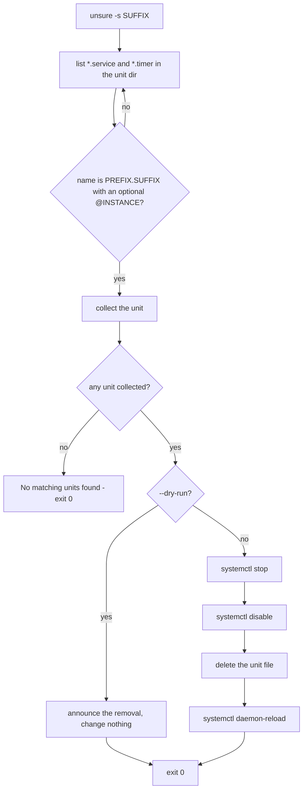

# 📦 unit-suffix-remover (unsure)

[](https://github.com/sponsors/kevinveenbirkenbach) [](https://www.patreon.com/c/kevinveenbirkenbach) [](https://buymeacoffee.com/kevinveenbirkenbach) [](https://s.veen.world/paypaldonate)

> Python CLI to stop, disable, and remove systemd `.timer` and `.service` units by suffix. 🔧🧹

## 🧭 How it works



## 🚀 Installation

```bash
pip install unit-suffix-remover
```

pip is the single supported installation path.

The package installs **two** identical commands: `unsure` (primary) and `usure` (kept for older documentation and scripts).

## 🔧 Requirements

* **Python 3.10+** 🐍
* **`systemctl`** on `PATH` (systemd)

If `systemctl` is missing, the command exits with code `127` and a one‑line error instead of a traceback.

## ⚙️ Usage

```bash
unsure -s SUFFIX [--dry-run] [--unit-dir DIR]
```

* `-s`, `--suffix`: suffix of unit files to target (e.g. `infinito` for `*.infinito.timer` and `*.infinito.service`). **Required**.
* `-d`, `--dry-run`: show actions without executing them.
* `--unit-dir`: directory to scan. Defaults to `/etc/systemd/system`.

Only the **exact** suffix directly before `@` or the extension matches:

| Unit file | `-s infinito` |
| --- | --- |
| `web.infinito.service` | ✅ matched |
| `web.infinito@db.timer` | ✅ matched |
| `web.infinito.nexus.timer` | ❌ extra part after the suffix |
| `web@db.infinito.timer` | ❌ suffix sits after `@` |
| `web.infinitoX.service` | ❌ suffix is only a prefix |

For full options:

```bash
unsure --help
```

### Exit codes

| Code | Meaning |
| --- | --- |
| `0` | Finished, or nothing matched. |
| `2` | Invalid command line arguments. |
| `127` | A required command is not installed. |

## 🧪 Development

```bash
make lint              # ruff check + ruff format --check
make format            # apply ruff format
make test              # unit + integration tests
make test-unit
make test-integration
make test-e2e          # install the package in a container and exercise the CLI
```

Tests run against the working tree — the `Makefile` puts `src/` on `PYTHONPATH`, so no install is needed. `--unit-dir` lets the integration tests work on a temporary directory instead of `/etc/systemd/system`.

## 👤 Author

Developed by **Kevin Veen‑Birkenbach**
🌐 [veen.world](https://www.veen.world/)

## 📜 License

This project is licensed under the **MIT License**.
